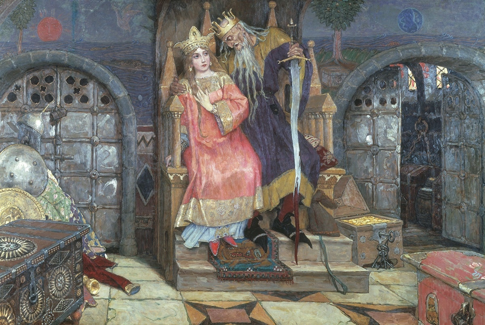
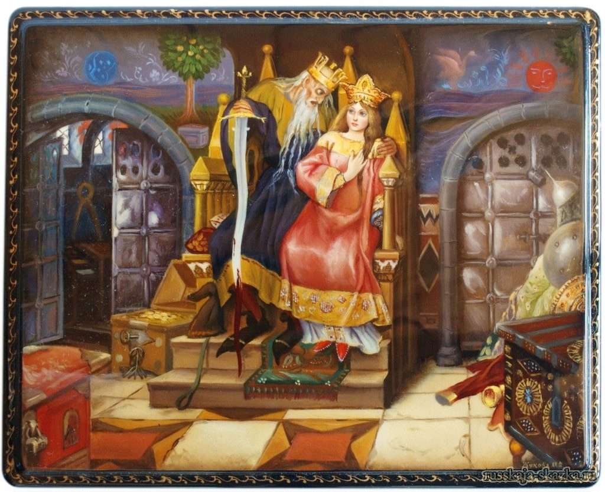
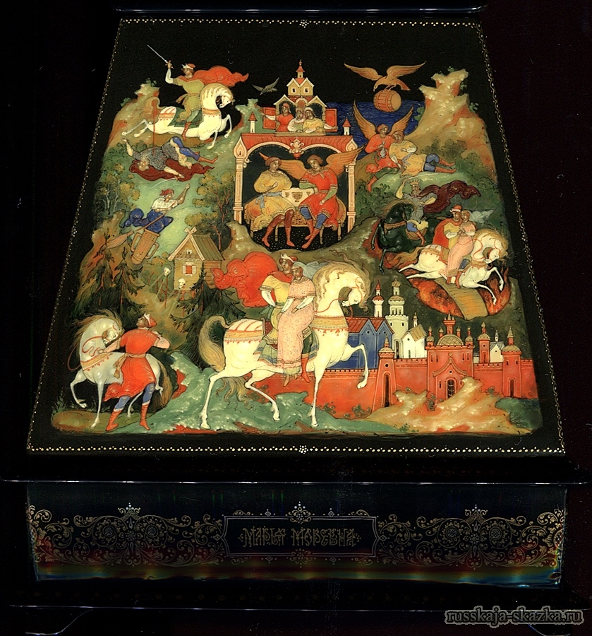
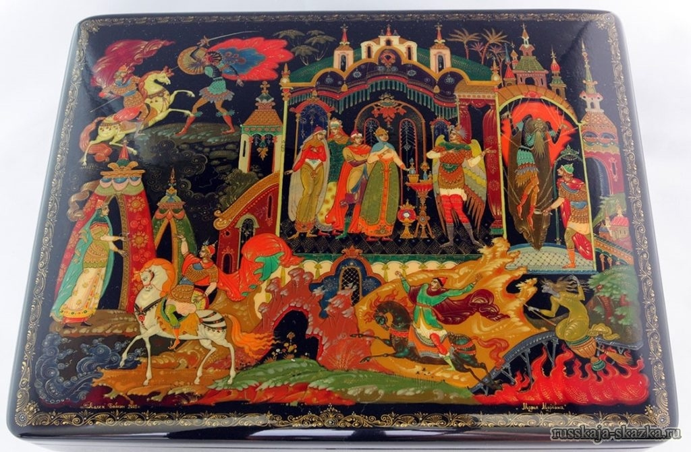

[wikipedia:不死者科斯切](https://en.wikipedia.org/wiki/The_Death_of_Koschei_the_Deathless)

不死者科斯切
* Koschei the Deathless

> 伊万·塔萨维奇（Ivan Tsarevich）有三个姐妹，第一个是玛丽亚公主，第二个是奥尔加公主，第三个是安娜公主。父母去世，姐妹嫁给三个巫师后，他离开家去寻找姐妹。他遇到了美丽的战士公主玛丽亚·莫夫纳（Marya Morevna），并嫁给了她。过了一会儿，她宣布要参加战争，并告诉伊万不要在他们居住的城堡里打开地牢的门。克服了渴望知道地牢的愿望，他在离开后不久就打开了大门，发现科斯基被束缚和瘦弱。 Koschei要求Ivan给他带来一些水。伊万这样做。在Koschei喝了十二桶水之后，他的魔力回到了他身上，他打破了链条并消失了。伊万（Ivan）发现科斯基（Koschei）捕获了玛丽亚·莫尔维纳（Marya Morevna）并追捕他之后不久。当伊万（Ivan）赶上科斯基（Koschei）时，科斯（Koschei）告诉伊万（Ivan）放手，但伊万（Ivan）不屈服，而科希（Koschei）杀死了他，将他的遗体放入桶中，将其扔进海中。伊万（Ivan）被姐妹的丈夫恢复了 - 可以变成猛禽的有力巫师。他们告诉他，科斯基有一匹魔术马，伊万也应该去巴巴·亚加（Baba Yaga）获得一匹魔术，否则他将无法击败科斯基（Koschei）。伊万（Ivan）幸存下来的测试并获得马匹之后，他与科什伊（Koschei）战斗，杀死他并烧毁了他的身体。玛丽·莫尔维纳（Marya Morevna）返回伊万（Ivan），他们与姐妹和丈夫一起庆祝他的胜利。

