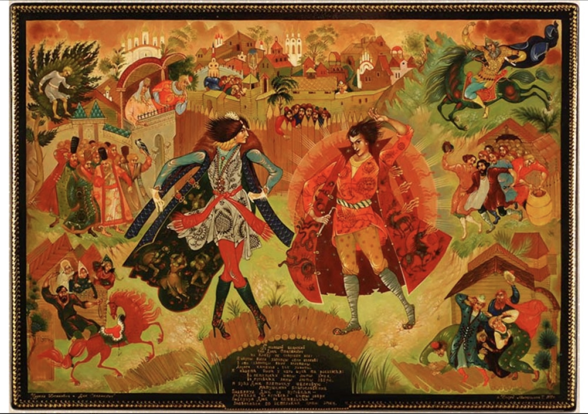
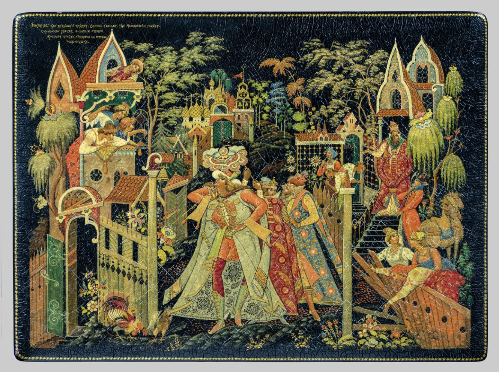

[wikipedia:丘里洛-普伦科维奇](https://ru.wikipedia.org/wiki/%25D0%25A7%25D1%2583%25D1%2580%25D0%25B8%25D0%25BB%25D0%25BE_%25D0%259F%25D0%25BB%25D1%2591%25D0%25BD%25D0%25BA%25D0%25BE%25D0%25B2%25D0%25B8%25D1%2587)

丘里洛-普伦科维奇
Чурило Плёнкович

史诗中有三个关于丘里拉的故事：
弗拉基米尔王子前往丘里拉的庄园，丘里拉在基辅担任管家兼酒政 ，后来担任“宴会召集人”；
丘里拉与斯捷潘诺维奇公爵之间的竞争以及丘里拉的耻辱；
丘里拉 (Churila) 与贝尔米亚塔 (Bermyata) 的妻子，年轻的卡捷琳娜·尼库利奇娜 (Katerina Nikulichna) 有染，最终这对恋人死于嫉妒的丈夫之手。

丘里洛与斯捷潘诺维奇公爵

丘里洛-普伦科维奇

